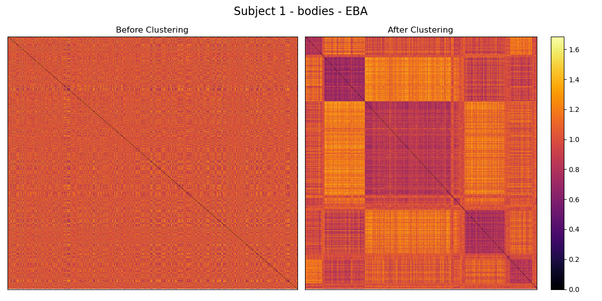
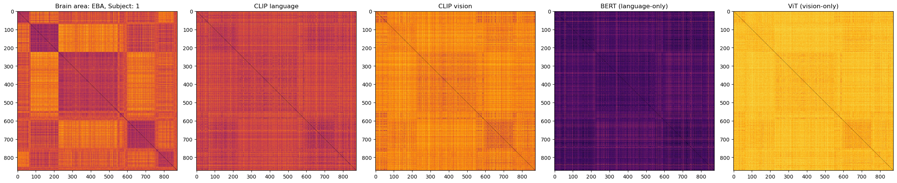
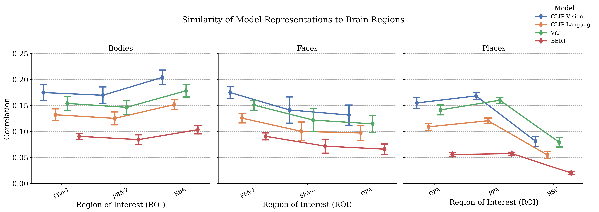

# Probing Cross-Modal Representational Alignment in Pretrained Vision and Language Models

This repository contains the code for the Neuromatch Academy NeuroAI course project by the team TyrOsine.

Recent advances in deep learning have revealed that model representations can resemble those found in the brain, particularly in sensory regions such as visual and auditory cortex (see Doerig et al. (2022) for a review). However, it remains underexplored which aspects of model design—modality, task specification and multimodal integration—significantly influence representational alignment with brain activity.

In this project, we will apply representational similarity analysis (RSA) between fMRI neural recordings obtained in the Natural Scenes Dataset (Allen et al., 2022) and model activations from pretrained vision, language and multimodal models. Our goal is to test how sensory input and task specification contribute to cognitively aligned representations, by comparing a range of architectures on image-caption stimuli. We are leveraging the Net2Brain toolbox (Bersch et al., 2025) for rapid experimentation and analysis towards this goal.

**Research questions:**

- How well do unimodal vision and language models align with brain representations during perception of images and language, respectively?

- Do multimodal vision-language models better explain brain responses than unimodal models during image presentation?

- How does task specification (e.g. autoencoding, semantic segmentation, next-token prediction) influence brain-model alignment across cortical regions?

## Setup

To get started, clone the repository and run the setup script:

```bash
git clone https://github.com/emrecncelik/tyrosine.git
cd tyrosine
./setup.sh
```

This will create a `conda` environment named `net2brain`, and install the required packages.

## Usage

### Feature extraction
First, you will need to download the dataset and extract the features from the models, to do that you'll only need to run the following command,
```bash
conda activate net2brain
python src/extract_features.py
```
This will extract the final layer features from ViT (visual), BERT (textual), and CLIP (textual and visual) and save them under the folder `features_modality`. 

### RDM Clustering and Ordering by Clusters
After extracting the features, we'll need to cluster the fMRI RDMs based on the dissimilarities in the matrix itself in order to see common patterns across model and human representations. The following should do the trick,
```bash
python src/cluster_fmri_rdms.py --subject 1
```
We use RDMs from subject 1 by default, but you can apply clustering on any subject (1 to 8). Alongside the clustering this will create RDM heatmaps before and after cluster ordering such as,



Following the clustering, we can now plot the RDMs of the various models and fMRI RDMs side by side to see the similarities. An example output is given below where you can see loosely similar dissimilarity matrices,

```bash
python src/show_rdm_comparison.py
```



In order to quantitatively measure the similarities between RDMs you can run the snippet below, this will output a file called `similarities.csv`. 

```bash
python src/compare_rdms.py
```

Finally, running `python src/plot_comparison.py` will give you he following plot showing the mean and the standard error bars for each region of interest, modality, and model.


